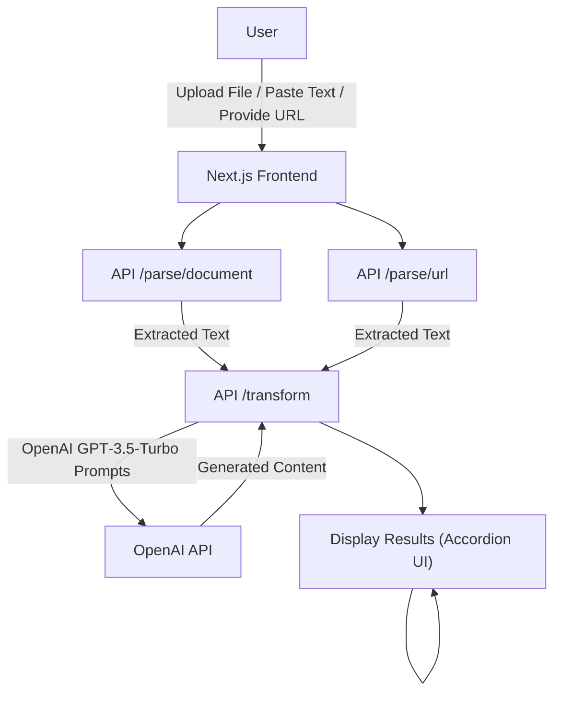

# Content Repurposing Engine

## A. Problem Statement

**What issue are we solving?**

Creators, marketers, and professionals often have long‑form content (PDFs, DOCX files, web articles, or plain text) that they want to reuse across multiple social platforms. Manually rewriting the same material for LinkedIn, Twitter, blogs, YouTube, email newsletters, and Instagram is time‑consuming, error‑prone, and leads to inconsistent messaging.

## B. Solution Overview

**AI‑driven repurposing engine** that:
- Accepts **PDF, DOCX, direct text, or a URL**.
- Extracts the raw text (using `pdf2json`, `mammoth`, or the Jina AI Reader for JavaScript‑rendered pages).
- Sends the extracted content to **OpenAI GPT‑3.5‑Turbo** with carefully crafted prompts to generate:
  - LinkedIn post
  - Twitter/X thread
  - Short blog post
  - YouTube video description
  - Email draft
  - Instagram caption
- Returns all results in a single JSON payload.
- UI displays each output in a **collapsible accordion** with copy‑to‑clipboard functionality.

**Expected impact & value**
- Cuts repurposing time from hours to seconds.
- Guarantees consistent tone and key messaging across channels.
- Enables small teams or solo creators to maintain a strong multi‑platform presence.

## C. Architecture Diagram



## D. Tech Stack

| Layer | Technology |
|-------|------------|
| **Frontend** | Next.js 16 (React, Turbopack), TypeScript, CSS Modules, Lucide‑React icons |
| **Backend (API)** | Next.js API Routes (Node.js), TypeScript |
| **PDF Parsing** | `pdf2json` (Node‑native) |
| **DOCX Parsing** | `mammoth` |
| **URL Parsing** | Jina AI Reader (`https://r.jina.ai/`) – no API key required |
| **AI Generation** | `openai` npm package – **GPT‑3.5‑Turbo** |
| **State Management** | React `useState` |
| **Styling** | Vanilla CSS (custom design system, dark‑mode ready) |
| **Version Control** | Git |

## E. How to Run Your Project

1. **Clone the repository**
   ```bash
   git clone <repo‑url>
   cd aiforbuildathon
   ```
2. **Install dependencies**
   ```bash
   npm install
   ```
3. **Create a `.env.local` file** in the project root with the following placeholders:
   ```env
   OPENAI_API_KEY=your_openai_api_key_here
   ```
   *Do NOT commit this file.*
4. **Start the development server**
   ```bash
   npm run dev
   ```
   The app will be available at `http://localhost:3000`.
5. **Use the UI**
   - Upload a PDF/DOCX, paste raw text, or enter a URL.
   - Click **Generate**.
   - Expand each accordion section to view the AI‑generated LinkedIn post, Twitter thread, blog, YouTube description, email draft, and Instagram caption.
6. **Optional – Production build**
   ```bash
   npm run build
   npm start
   ```

## F. API Keys / Usage Notes

- **OpenAI API Key**: Required for content generation. Obtain it from the OpenAI Platform → API Keys page. Insert the key into `.env.local` as shown above.
- **Jina AI Reader**: No API key needed; it works as a public endpoint (`https://r.jina.ai/<URL>`). It can handle JavaScript‑rendered pages, but extremely large pages may be truncated.
- **Rate limits**: GPT‑3.5‑Turbo has generous free‑tier limits, but heavy usage may require a paid plan. Adjust `max_tokens` in the prompts if you encounter quota errors.
- **Security**: Never expose your `.env.local` file or API keys in version control or public repositories.

---
SO GO ON
